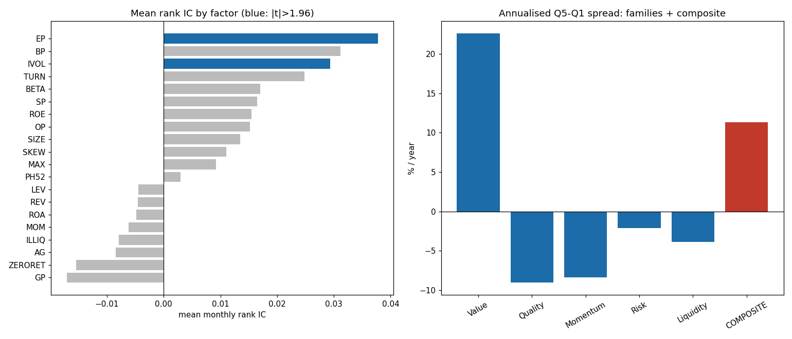

# VN Factor Models

Empirical factor research for the **Vietnamese equity market** (HOSE / HNX) — two complementary
strands on live `vnstock` data:

1. **Cross-sectional factor library** — an independent test of the 30-factor BeeTrade report
   *A Cross-Sectional Factor Library for the Vietnamese Equity Market* (June 2026).
2. **Barra-style risk model** — a weekly cross-sectional risk model for VN100.

---

## 1. Cross-sectional factor library  ⭐

End-to-end test of **20 factors across 5 families** on the liquid universe (VN100 ∪ HNX30, ~130
names), following the report's methodology (§3) and evaluation protocol (§3.4).

**Method.** Point-in-time characteristics → robust z-score (median/MAD, 1/99 winsor) →
**sector + size neutralisation** → signed so a *positive IC means the factor works as the report
expects* → evaluated by rank **IC / t-stat / IR**, quintile **Q5−Q1 spread**, **1–3m decay**,
**net-of-cost** spread, and a conviction-weighted **composite**. A final GLM-4.6 (z.ai) stage writes
a claim-by-claim verdict.

**Headline results** (monthly, 2018–2026 for price factors, 2023–2026 for fundamentals):

| Finding | Evidence | vs report |
|---|---|---|
| **Value is the one robust premium** | composite IC **t=2.81**, monotonic, **+22.6%/yr**; EP t=2.27 | ✅ confirmed |
| **Low idiosyncratic vol works** | IVOL IC=0.029, **t=2.40** | ✅ partial (only IVOL) |
| Momentum / Size / Illiquidity weak or inverted | MOM t=−0.45, SIZE t=1.21, ILLIQ IC=−0.008 | ✅ confirmed |
| Short-term reversal & operating profitability **don't** dominate | REV t=−0.36 (net −6.4%/yr); OP t=0.68 | ❌ contradicts report |



📄 **Full write-up: [`docs/EXPERIMENTS.md`](docs/EXPERIMENTS.md)** ·
reference report: [`docs/Vietnam_Equity_Factor_Library_Bee.pdf`](docs/Vietnam_Equity_Factor_Library_Bee.pdf)

### Pipeline

```bash
pip install -r requirements.txt
python src/fetch_data.py          # VN100+HNX30 universe, daily prices, quarterly ratios
python src/fetch_fund.py          # annual income + balance statements (FY2022-2025)
python src/factors.py             # PIT characteristics -> signed, neutralised factor scores
python src/evaluate.py            # IC / spreads / decay / composite -> results/ + docs/factor_results.png
ZAI_TOKEN=*** python src/zai_review.py    # GLM-4.6 (z.ai) claim-by-claim verdict
```

| file | role |
|---|---|
| `src/fetch_data.py` | universe (VN100∪HNX30) + daily OHLCV + quarterly ratios |
| `src/fetch_fund.py` | annual income statement + balance sheet (fundamental panel) |
| `src/factors.py` | 20 factors; robust-z, sector/size neutralisation, sign convention |
| `src/evaluate.py` | rank IC, quintile spreads, decay, net-of-cost, composite |
| `src/zai_review.py` | GLM-4.6 (z.ai) analysis of results vs the report |
| `src/grs_test.py` | Gibbons-Ross-Shanken joint-alpha F-test |

> **Data note.** The `vnstock` community tier returns only ~4 recent financial periods, so
> Value/Quality factors are built from annual statements (FY2022–25) and tested on a short
> 39-month window — indicative, not definitive. Price-based factors use the full history. Raw data
> is git-ignored and regenerable.

---

## 2. Barra-style risk model

Weekly cross-sectional WLS of returns on per-stock exposures (8 styles + industry) for VN100, giving
factor returns, a factor covariance matrix, and portfolio risk decomposition.
See [`docs/BARRA.md`](docs/BARRA.md) · code in [`src/barra/`](src/barra).

---

## Background docs

- [`docs/README.md`](docs/README.md) — research design notes (VN-4 model, anomaly catalogue)
- [`docs/EXPERIMENTS.md`](docs/EXPERIMENTS.md) — factor-library experiment results
- [`docs/BARRA.md`](docs/BARRA.md) — Barra risk-model notes

*Research code only — not investment advice. Past factor behaviour does not guarantee future returns.*
