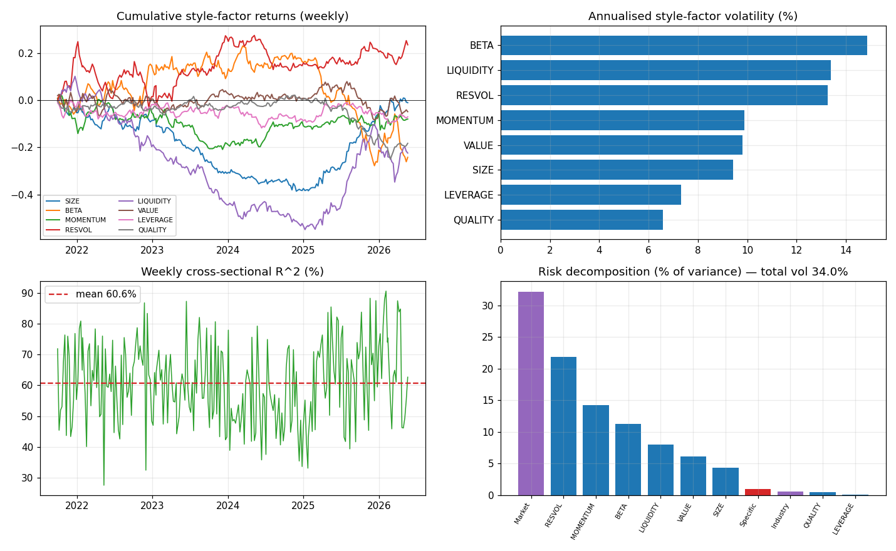

# Barra-style cross-sectional risk model — VN equities

A proper **Barra-type risk model** for the Vietnamese market, added alongside the existing
Fama-French VN-3/VN-4 academic factors. Different methodology and goal: instead of testing a
few factor-mimicking portfolios in time series, we run a **weekly cross-sectional regression of
returns on per-stock exposures** to estimate factor returns + a factor covariance matrix, and use
it to **decompose and forecast portfolio risk**.

## Pipeline (`src/barra/`)

| step | file | what |
|---|---|---|
| 1 | `fetch_barra_data.py` | VN100 daily prices, quarterly ratios, industry map via vnstock (rate-limited: 60 req/min, throttled + resumable) |
| 2 | `exposures.py` | weekly point-in-time standardised exposures (8 styles + industry one-hot) |
| 3 | `estimate.py` | weekly WLS: `r = f_country + Σ X_ind·f_ind + Σ X_style·f_style + u`, constraint `Σ capwt·f_ind = 0`, weights `√mcap`, solved via KKT |
| 4 | `report.py` | factor significance, cross-sectional R², portfolio risk decomposition, `docs/barra.png` |

**Style factors** (standardised cross-sectionally each week → cap-weighted mean 0, std 1, winsorised ±3 MAD):
SIZE (log mcap), BETA, MOMENTUM (12-1m), RESVOL (120d), LIQUIDITY (60d turnover), VALUE (EP+BM),
LEVERAGE (Debt/Equity), QUALITY (ROE). **Industries** (coarse, ≥4 names): Banks, Real estate,
Securities, Utilities, Food & bev, Construction, Building materials, Plastics-chem, Transport, Other.
No look-ahead: price descriptors use data ≤ t; fundamentals use the latest quarter reported ≥45d before t.

## Results (real data, 79 VN100 names fetched, 242 weekly fits, 2021-2026)

- **Average cross-sectional R² = 60.6%** — exposures explain a large share of return dispersion (market + industry + style), a healthy model fit.
- **Style premia are NOT statistically significant** over this window (all |t| < 1.3; strongest is QUALITY t = −1.28). Honest read: in a thin VN100 universe over ~5 years, no style earns a reliable premium — expected for a frontier market with a short sample. This is a **risk** model, not an alpha claim.
- **Risk decomposition** of an equal-weight VN portfolio (latest week, N≈47): total annualised vol **34%**, of which **factor 33.8% / specific only 3.3%** — i.e. idiosyncratic risk is almost fully diversified and risk is dominated by the **Market (32% of variance)** plus common style factors (RESVOL 22%, Momentum 14%, Beta 11%). Typical of a market where stocks co-move strongly.

## Honest caveats / next steps

- Only **79/100** names fetched (vnstock community rate-limit); ~46-47 effective stocks/week after the 1-yr history filter — thin for ~19 factors, so industry/style estimates are noisy. Expanding to HOSE (~400) would firm this up.
- BETA uses an equal/median market proxy; fundamentals are lagged quarterly (mild staleness).
- Risk model uses sample covariance — production would add EWMA + Newey-West, plus **bias-statistic backtests** (does forecast vol match realised?) and factor-risk attribution for live portfolios.
